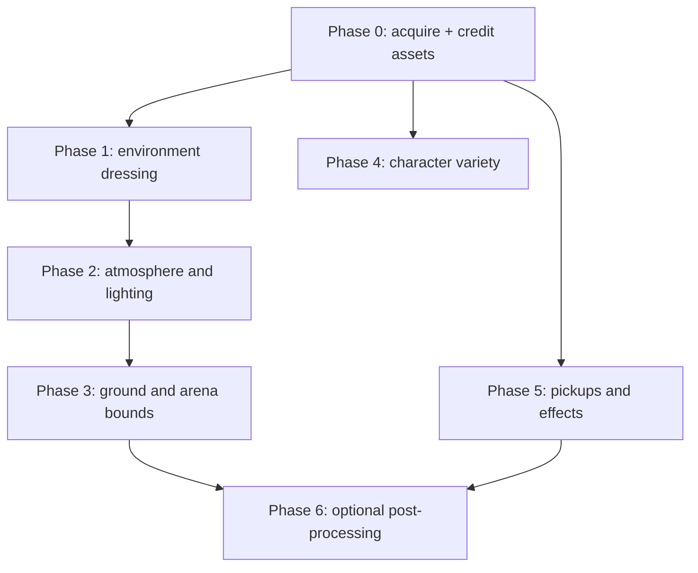

# Artwork Enhancement Plan — opengame

Goal: upgrade the arena from its current bare look (flat green plane, 4 models,
placeholder spheres) to a polished low-poly outdoor arena — without touching the
server-authoritative simulation. All changes here are **client-side visuals
only**.

## 1. Current state (verified)

| Area | Today | Evidence |
|------|-------|----------|
| Models | 4 GLBs, all CC0 by Quaternius: adventurer (player), orc (enemy), tree, rock | `assets/credits/metadata.json` |
| Model loading | `GLTFLoader`, one shared load, cloned per entity | `src/scenes/GameScene.js:174-186` |
| Ground | 512px canvas texture (grid + speckles), repeated 6x | `src/scenes/GameScene.js:359-387` |
| Props | 9 trees + 10 rocks, deterministic LCG scatter, kept out of central spawn zone | `src/scenes/GameScene.js:402-423` |
| Arena bounds | 4 translucent blue boxes | `src/scenes/GameScene.js:390-398` |
| Sky/atmosphere | Flat color `0x87ceeb`, no fog | `src/scenes/GameScene.js:47` |
| Lights | Hemisphere (0.75) + directional sun (1.2) with 2048px shadow map | `src/scenes/GameScene.js:52-62` |
| Orbs / power-ups | Plain glowing spheres (procedural) | `src/config.js:47-57` |
| Audio | Procedural WebAudio, zero files | `src/audio/SoundManager.js` |
| Asset policy | "CC0 preferred; CC-BY only with attribution. No unlicensed assets." | `assets/credits/metadata.json` |

What is missing: grass, bushes, flowers, terrain variety, sky depth, atmosphere,
distinctive pickup visuals, character variety.

## 2. Style guide (non-negotiable)

1. **Low-poly, flat-shaded, Quaternius-style** — matches the 4 existing models.
   No realistic/PBR-heavy assets; they clash visually.
2. **License: CC0 only.** CC-BY is acceptable only if attribution is added to
   both `assets/credits/metadata.json` and `assets/credits/credits.csv`.
   No GPL, no "non-commercial" assets.
3. **Every new asset is recorded** in `assets/credits/metadata.json` (entry in
   the `assets` array) and `assets/credits/credits.csv` (one row) before merge.
4. **Determinism**: anything placed procedurally must use the existing seeded
   RNG pattern (`makeRng`, `src/scenes/GameScene.js:20-26`) so all clients
   render an identical arena.
5. **Gameplay parity**: props stay visual-only. The server does flat-plane
   collision (`src/server/config.js:24`); no visual change may imply walkable
   geometry that the server does not simulate.

## 3. Asset wishlist

All from CC0 sources (poly.pizza, quaternius.com, kenney.nl). Prefer the same
authors as the current assets for style coherence.

| Asset | Purpose | Target dir | Notes |
|-------|---------|-----------|-------|
| Grass tuft / clump | Ground cover, instanced | `assets/props/grass.glb` | under 300 tris |
| Bush / shrub | Mid-height variety | `assets/props/bush.glb` | |
| Flower (2-3 colors) | Color accents | `assets/props/flower.glb` | tint variants via material color |
| Tree variant (pine or autumn) | Breaks tree repetition | `assets/props/tree_pine.glb` | |
| Rock variant / boulder cluster | Breaks rock repetition | `assets/props/rock_big.glb` | |
| Log or stump | Extra dressing | `assets/props/stump.glb` | optional |
| Mushrooms | Micro-detail near trees | `assets/props/mushroom.glb` | optional |
| Low-poly orb/gem model | Replace placeholder orb spheres | `assets/props/orb.glb` | optional; keep emissive |
| Second playable character | Character variety | `assets/characters/knight.glb` | must ship `CharacterArmature\|Idle/Run/Sword_Slash` clips |

Search terms that work on poly.pizza: "nature", "grass", "bush", "flower",
"pine", "boulder", "mushroom", "gem".

## 4. Phased plan

### Phase 0 — Asset acquisition and crediting

- Download the wishlist items as GLB; convert FBX/OBJ via Blender
  (File > Export > glTF 2.0).
- Drop files into the dirs above; add credits entries (both files).
- Acceptance: every file under `assets/` has a credits row; GLBs open cleanly
  in a three.js sandbox.

### Phase 1 — Environment dressing (biggest visual win)

- Extend `loadModels()` (`src/scenes/GameScene.js:174-186`) with the new props.
- Extend `scatterProps()` (`src/scenes/GameScene.js:402-423`):
  - bushes: ~12 clones, same `place()` pattern as trees/rocks;
  - flowers: ~30, smaller scale range, material-color tint variants;
  - stumps/logs: ~4, biased near trees (reuse the tree positions);
  - **grass: `THREE.InstancedMesh` (250-400 instances, one draw call)**,
    matrices from the same seeded RNG, `castShadow = false` (fill-rate),
    excluded from the central spawn zone like other props.
- Keep the existing LCG seed (4242) and draw order, appending new RNG calls
  after existing ones so tree/rock positions do not shift.
- Acceptance: two browser tabs show identical arenas; grass costs one draw
  call; no new per-frame allocation.

### Phase 2 — Atmosphere and lighting

- Add `scene.fog` (e.g. `new THREE.Fog(0x87ceeb, 45, 110)`) matched to the sky
  color so the arena edge fades instead of clipping against the far plane
  (`src/scenes/GameScene.js:47-49`).
- Warm the sun slightly (e.g. `0xfff2cc`) and lower hemisphere intensity to
  keep contrast; keep intensities as CONFIG knobs in `src/config.js`.
- Optional: a sky gradient via a large inverted sphere or vertex-color
  background instead of the flat color — cheap and no assets needed.
- Acceptance: no visible pop-in at the arena edge at default camera distance;
  shadows unchanged in quality.

### Phase 3 — Ground and arena bounds

- Upgrade `buildGround()` (`src/scenes/GameScene.js:359-387`): keep the
  procedural canvas texture (zero downloads) but improve it — larger tile
  (1024), irregular speckle patches, soft dirt path rings near spawn, drop the
  hard grid lines in favor of subtle mottling. Alternatively swap in a CC0
  tileable grass texture (ambientCG) if download size budget allows.
- Replace or dress the translucent wall boxes
  (`src/scenes/GameScene.js:390-398`): e.g. a ring of hedge/bush instances
  along the bounds, keeping the translucent boxes as a faint fallback so the
  boundary stays readable.
- Acceptance: ground reads as grass at both close-up and full-arena zoom;
  bounds unmistakable.

### Phase 4 — Character variety (optional, follow-up)

**Status: DONE (2026-08-15).** Implemented as a login-screen roster of four
classes (Swordsman/Archer/Mage/Spike Man) riding a new `PlayerState.character`
field; server clamps the index; per-class GLB + weapon + anim mapping live in
`CONFIG.characters`. The Swordsman uses the user-supplied Dawid2K knight
(CC-BY 3.0, static rig with procedural anim fallback) plus the Quaternius
sword prop; see README "Artwork" for the full roster.

- Add one more CC0 rigged character (same `CharacterArmature|...` clip names
  the mapping in `src/config.js:74-86` already expects) so clients can pick a
  look; selection is cosmetic only.
- Keep the existing per-player tint system.
- Requires a small client message for model choice; **only client visuals
  change — server schema untouched** (model index can ride the existing
  join/name path if we later want it persisted; default = adventurer).
- Acceptance: both characters animate identically (idle/run/attack).

### Phase 5 — Pickups and effects

- Replace orb placeholder spheres with a CC0 low-poly gem/orb GLB (or a
  better procedural crystal: `IcosahedronGeometry` + emissive pulse) — visual
  only; server orb state unchanged.
- Power-up auras: distinct silhouettes per type (speed = arrow/chevrons,
  shield = bubble already exists at `src/config.js:61`, double = coin stack).
- Acceptance: each pickup type identifiable at a glance across the arena.

### Phase 6 — Optional post-processing (gated)

- `EffectComposer` + `UnrealBloomPass` from `three/addons/` (already covered
  by the importmap, `index.html:103-111`) at low strength for orb/sun glow.
- Gate behind `CONFIG.renderer.bloom` + the existing `env.js` injection path
  (`src/server/config.js:15` pattern with `DISABLE_SHADOWS`) so low-end
  clients can turn it off; default OFF until perf-verified.
- Acceptance: 60fps on a mid-tier laptop at dpr 2 with bloom on; otherwise
  ship disabled.

## 5. Performance budget

| Item | Budget | Why |
|------|--------|-----|
| New draw calls (all phases) | under 10 total | grass/flowers are instanced (1 each); props reuse clones |
| Grass instances | 250-400, `castShadow=false` | fill-rate on retina is the bottleneck; dpr already clamped to 2 (`src/config.js:24`) |
| New GLB total size | under 2 MB | browser load; join already has a 15s load guard (`src/config.js:31`) |
| Tris per prop | under 3k | mobile-friendly |
| Shadow casters | only tree/bush/rock/stump | grass and flowers never cast |
| Per-frame allocation | zero | follow the `ParticlePool` / `FloatingTextPool` pooling pattern |

## 6. Verification checklist (per phase)

1. `npm run check` passes (add any new file to the script list in `package.json`).
2. `npm run test` passes (FSM + headless multiplayer must stay green — they
   boot the real server).
3. `python3 test/browser.test.py` against a running server (catches scene
   wiring errors the node tests cannot see).
4. Manual: two tabs at `http://localhost:2567` show an **identical** arena
   (determinism), props avoid the spawn zone, no shadow acne, 60fps.
5. Credits: every new file has rows in both `assets/credits/` files.

## 7. Risks

| Risk | Mitigation |
|------|-----------|
| Style clash from mixed authors | Only Quaternius-style CC0 packs; reject anything realistic |
| Scatter determinism breaks between tabs | Single seeded RNG, fixed draw order, appended calls only |
| Load-time regression from many GLBs | Budget 2 MB, keep the 15s load guard, lazy-load Phase 4+ models after join |
| Grass fill-rate on low-end GPUs | Instancing + no shadows + optional density knob in CONFIG |
| License drift | Credits files updated in the same commit as the asset; reviewed |

## 8. Out of scope

- Server/simulation changes, collision for props, terrain height variation
  (server physics is a flat plane).
- Audio changes (procedural synth stays).
- Mobile touch controls (separate effort).

